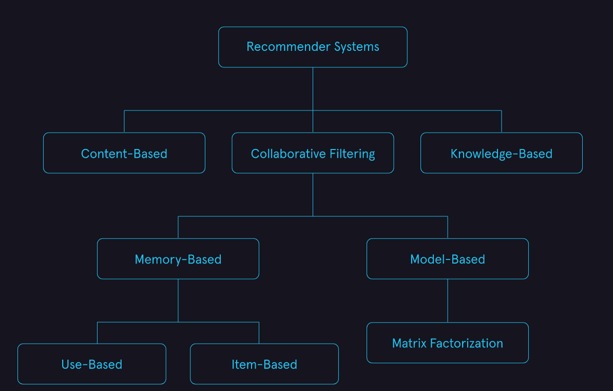

# Ranking task

Some sources distinguish the ranking task as a separate class of machine learning tasks.

## Formal task description

Let's denote:
- Set of the abstract objects as $O=\{o_i\}_{i=1}^n$;
- Set of the items as $I=\{i_j\}_{j=1}^m$.

For specific object $o_i$ we need to define order of items $I'$ such where the most relenant elements is on the top.

It is common to introduce a relevance (rating, untility) matrix $R=\left[ r_{ij} \right]_{n \times m}$. $r_{ij}$ reflects the relevance of $j$-th item to $i$-th object. Or more convenient ot think about it as about the table:

|   | $i_1$ | $i_2$ | ... | $i_n$|
|:--|:------|:------|:----|:-----|
|$o_1$|$r_{11}$|$r_{12}$|...|$r_{1n}$|
|$o_2$|$r_{21}$|$r_{22}$|...|$r_{2n}$|
|...|...|...|...|...|
|$o_m$|$r_{m1}$|$r_{m2}$|...|$r_{mn}$|

## Common appliances

There are two appliances:

- **Search engines** - where object is a query and item is a document that matches the query;
- **Recommender systems** - where object is a customer and item is a product suitable for consideration by the customer.

Looks like they have some differences. But they'll still be in the same section, while it'll be obvious how they differ. So sometimes here is information from sources about different applications.

## Common approaches

There are few common approaches to solving such problems. In practice, there can be confusion about names. Here is the classification that seems to me the most rational.

- **Collaborative filtering** is a recommender system technique that makes recommendations for a target user by using ratings information from other users. The driving principle behind collaborative filtering is that users that have similar ratings for items have similar tastes. See more on the [dedicated page for this group of approaches](ranking_task/collaborative_filtering.ipynb);
- **Content-based Filtering** is a recommender system technique that uses data about user preferences and attributes of items to model the likelihood a given user will like a specific item. This type of recommender systems tends to look more like the traditional machine learning models used in supervised learning;
- **Knowledge-Based** Knowledge-based recommender systems are a class of recommender systems used when there is not a lot of data available. Rules are explicitly programmed based on user preferences and domain knowledge. While an important class of recommender systems, we will not be discussing them in detail in this module.